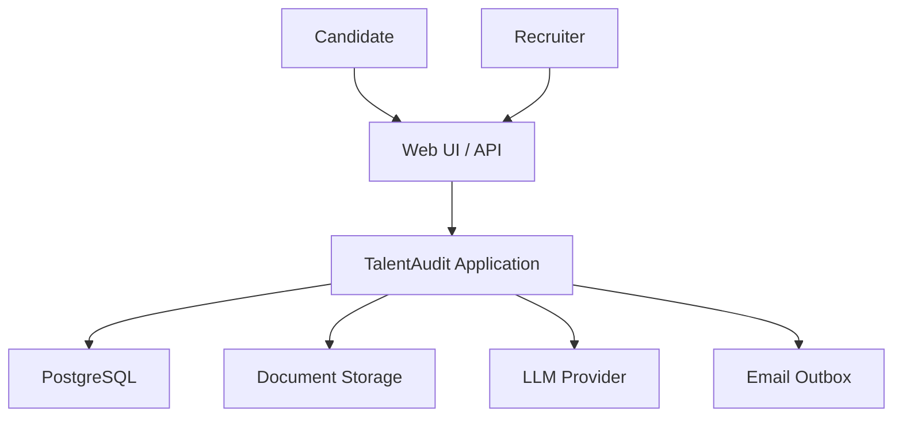
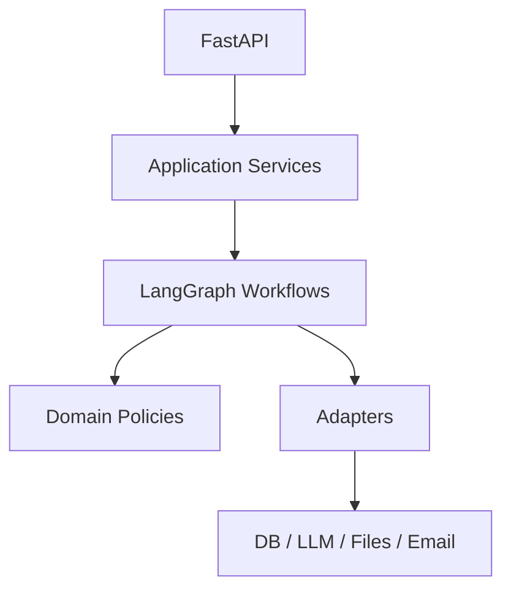
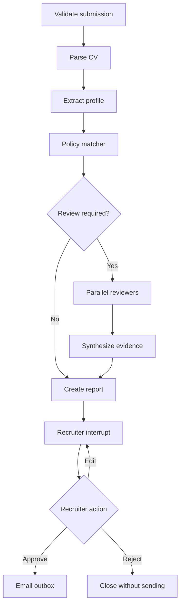

# 03 — Kiến trúc hệ thống

## 1. Architectural style

TalentAudit dùng **modular monolith** với ba lớp chính:

- **Interface:** FastAPI và UI.
- **Application:** use cases và LangGraph orchestration.
- **Domain/Infrastructure:** policy, entity, repository, parser, LLM, email, storage.

Lựa chọn này đủ chuyên nghiệp cho portfolio nhưng tránh chi phí vận hành microservices quá sớm.

Các adapter MVP được khóa: OpenAI, PostgreSQL, local document storage, Streamlit và fake email outbox. OpenAI SDK chỉ xuất hiện trong `adapters/llm`; workflow và domain chỉ phụ thuộc `LLMClient`.

## 2. System context

## 3. Application components

### Module responsibilities

| Module | Trách nhiệm |
|---|---|
| `api` | HTTP validation, auth context, response mapping |
| `application` | Use cases như submit CV, resume review |
| `workflows` | Nodes, routing, StateGraph và graph factory |
| `domain` | Entity, policy matcher, rubric và invariant |
| `schemas` | DTO/API/LLM structured output |
| `services` | Parsing, extraction, reporting |
| `repositories` | Repository interfaces và persistence operations |
| `adapters` | PostgreSQL, LLM provider, file storage, email outbox |
| `prompts` | Prompt templates và version metadata |
| `observability` | Logging, tracing, metrics |

## 4. Main workflow

### Borderline/debate extension

Debate không phải luồng mặc định. Nó chỉ chạy khi policy/reviewer confidence nằm trong vùng `borderline` đã cấu hình:

1. Reviewer A và B tạo opinion độc lập.
2. Mỗi reviewer nhận opinion còn lại.
3. Mỗi bên tạo một rebuttal có evidence.
4. Judge tổng hợp các điểm thống nhất, bất đồng và thông tin còn thiếu.

Giới hạn một vòng rebuttal trong phiên bản portfolio để kiểm soát cost và latency.

## 5. Deterministic versus LLM responsibilities

| Tác vụ | LLM | Deterministic code |
|---|---:|---:|
| PDF text extraction |  | ✓ |
| Chuẩn hóa profile từ text | ✓ | validation |
| Nhận dạng skill tương đương | ✓ | taxonomy lookup |
| Kiểm tra min years/required skills |  | ✓ |
| Tạo opinion từ rubric và evidence | ✓ | schema validation |
| Tính weighted score |  | ✓ |
| Soạn giải thích/email draft | ✓ | template/safety checks |
| Quyết định gửi email |  | ✓ |

## 6. API proposal

| Method | Endpoint | Mục đích |
|---|---|---|
| `POST` | `/api/v1/jobs` | Tạo job và policy |
| `GET` | `/api/v1/jobs/{job_id}` | Xem job |
| `POST` | `/api/v1/audits` | Upload CV và tạo workflow |
| `GET` | `/api/v1/audits/{audit_id}` | Xem status/report |
| `POST` | `/api/v1/audits/{audit_id}/decisions` | Resume HITL |
| `GET` | `/api/v1/audits/{audit_id}/events` | Xem audit trail |
| `POST` | `/api/v1/candidate-questions` | Candidate support router |
| `GET` | `/health` | Liveness |
| `GET` | `/ready` | Readiness |

POST cần idempotency key ở phase hardening để tránh tạo hai audit hoặc gửi hai email.

## 7. Data model proposal

| Table | Dữ liệu chính |
|---|---|
| `jobs` | title, description, rubric_version, status |
| `job_requirements` | required skill, min years, weight, mandatory |
| `candidates` | pseudonymous identifier; PII tối thiểu |
| `documents` | storage key, hash, mime, size, scan status |
| `audits` | job, candidate, workflow/thread id, status |
| `candidate_profiles` | normalized structured profile + schema version |
| `evidence_spans` | source document, section, offsets, quote hash/text |
| `policy_results` | rule id, result, explanation, evidence refs |
| `review_opinions` | reviewer type, score, confidence, evidence refs |
| `recruiter_decisions` | action, edited content, actor, timestamp |
| `outbox_messages` | recipient ref, payload, status, idempotency key |
| `audit_events` | event type, actor, metadata, timestamp |

CV file không lưu trực tiếp trong database. Database chỉ lưu metadata và storage key.

## 8. Integration boundaries

Mọi dịch vụ ngoài đi qua interface:

- `LLMClient.generate_structured(...)`
- `DocumentStorage.put/get/delete(...)`
- `EmailGateway.enqueue(...)`
- `AuditRepository.save/get(...)`
- `KnowledgeRepository.search(...)`

Trong test, thay các interface bằng fake để không gọi network.

## 9. Failure handling

| Loại lỗi | Xử lý |
|---|---|
| File sai loại/quá lớn | Reject trước workflow |
| Không extract được text | `NEEDS_REVIEW` |
| LLM timeout/rate limit | Retry exponential backoff có giới hạn |
| LLM sai schema | Một structured retry, sau đó `NEEDS_REVIEW` |
| Policy config lỗi | Fail closed; không đưa recommendation |
| Reviewer bất đồng cao | Flag recruiter hoặc chạy debate tùy cấu hình |
| DB/checkpointer lỗi | Không gửi side effect; retry/resume an toàn |
| Email lỗi | Outbox retry; không chạy lại toàn graph |

## 10. Configuration

Tất cả cấu hình qua `Settings` và environment:

- model/provider, temperature, token limit;
- database URL, storage path;
- max file size và allowed MIME;
- review threshold và borderline band;
- feature flag `ENABLE_DEBATE`;
- feature flag `ENABLE_REAL_EMAIL=false` mặc định;
- retention period và redaction settings.

## 11. Bilingual design

- Detect và lưu `document_language`: `vi`, `en` hoặc `mixed`.
- Candidate profile schema dùng canonical field names bằng tiếng Anh để code ổn định.
- Evidence giữ nguyên ngôn ngữ gốc, không dịch trước khi tính offset.
- Skill taxonomy lưu canonical skill và aliases tiếng Việt/Anh.
- Prompt có instruction song ngữ nhưng structured output dùng cùng một schema.
- UI ưu tiên tiếng Việt; report có thể giữ evidence nguyên bản và giải thích tiếng Việt.
- Evaluation tách kết quả theo ngôn ngữ để tránh một điểm trung bình che giấu chất lượng kém ở một nhóm.
